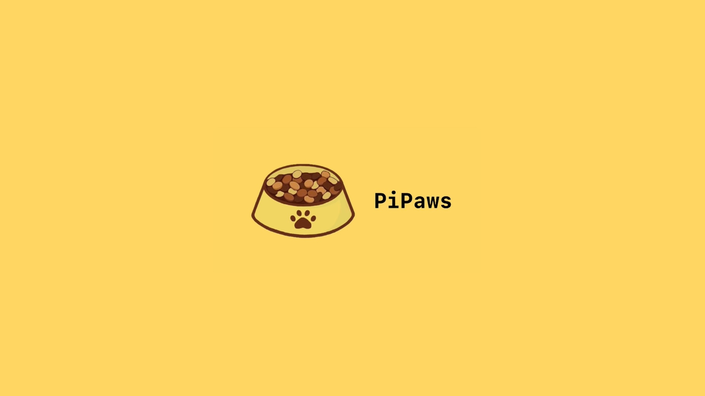

## Video:
[](https://youtu.be/w9p5YQA9ulU)

## What is PiPaws? 🤔
PiPaws is a software and hardware combined project created by a group of students who go by Pawgrammers, a product designed to allow pet owners to remotely dispense food with the click of a button through a web application. The system includes a camera for confirming pet consumption and features for collecting data on the pet’s diet. The logged data will then be displayed through the web application, giving users a clear idea of their pets’ diet conditions. Ultimately, this project provides an automated solution for pet owners who cannot dispense food for their pets in person regularly, making feeding their pets much more convenient.

## Development of PiPaws: ⚙
In terms of the development of the webpage, frontend components including the user interface components for different pages were built using React.js, and Node.js along with frameworks such as Tailwind.css. Firebase was used for the implementation of login authentication and the deployment of the database used to store feeding data. Tasks related to computer vision, camera functionalities, and image processing were accomplished using the Picamera library and RPi.GPIO modules (used to control Raspberry Pi’s GPIO channels). Moreover, the pet feeder relies on Raspberry Pi’s GPIO for the controlling of the rotational motors. The structure of a Raspberry Pi connected to the camera and rotational motor is the major hardware component of the pet feeder. The motor will rotate to dispense food from a circular container with two physical layers: an upper layer that has an open sector and a lower layer that spins. When pet food is dispensed, the camera will be activated simultaneously to detect the motion of the pet.

## Getting Started 🏁

Follow these steps to set up and run the PiPaws web application locally:

1. Clone the repository:

   ```bash
   git clone https://github.com/yourusername/PiPaws.git

2. Install the required dependencies:
   ```bash
   pip install -r requirements.txt

3. setup the Flask web application:
    ```bash
    python app.py

4. Access the application in your web browser at
    ```bash
    http://localhost:5000


## Author ✍️
Mikayla Mao,
Rita Xiang,
Lily Zhang,
Owen Zhang,
Umar Mustafa,
Shayyan Husein
